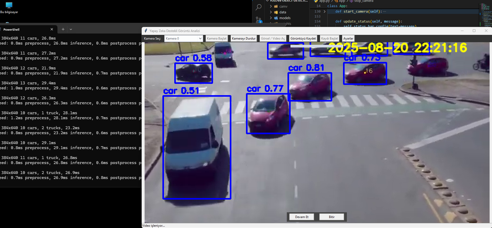

# YOLOv8 Object Detection GUI


A user-friendly desktop application for real-time and file-based object detection using the YOLOv8 model. This tool provides an intuitive graphical user interface (GUI) to perform object detection on webcam feeds, videos, and images.


*(Note: It is highly recommended to replace the link above with a screenshot of your running application for a more professional look.)*

## Features

- **Real-time Detection:** Performs object detection on live webcam streams.
- **File-based Detection:** Analyze pre-recorded videos (`.mp4`, `.avi`) and static images (`.jpg`, `.png`).
- **Multi-camera Support:** Automatically detects and allows selection from available cameras.
- **Save & Record:**
    - Save the current processed frame as an image.
    - Record the live detection output to a video file.
- **Intuitive UI:** A clean and simple graphical interface built with Tkinter, featuring a status bar for user feedback.
- **Dynamic Timestamp:** Overlays the current date and time on the video feed.
- **Customizable:** Allows users to adjust the application window size through a settings panel.

## Technologies Used

- **Model:** YOLOv8 (from `ultralytics`)
- **Computer Vision:** OpenCV (`opencv-python`)
- **GUI:** Tkinter, ttkthemes
- **Core Libraries:** PyTorch, NumPy, Pillow

## Setup and Installation

Follow these steps to get the application running on your local machine.

### Prerequisites

- Python 3.7 or higher
- pip (Python package installer)

### Installation Steps

1.  **Clone the repository:**
    ```sh
    git clone https://github.com/FurkanTIMUR/yolov8-object-detection.git
    cd yolov8-object-detection
    ```
    *(Note: This link is a placeholder. You will update it with your own repository link after creating it on GitHub.)*

2.  **Create a virtual environment (recommended):**
    ```sh
    python -m venv venv
    source venv/bin/activate  # On Windows use `venv\Scripts\activate`
    ```

3.  **Install the required dependencies:**
    ```sh
    pip install -r requirements.txt
    ```

## How to Run

Once the setup is complete, you can launch the application by running the `app.py` script:

```sh
python app.py
```

## Usage
- Start Camera: Select a camera from the dropdown and click "Kamera Başlat" to begin real-time detection.

- Open File: Click "Görsel / Video Aç" to select an image or video file for analysis.

- Save Image: Click "Görüntüyü Kaydet" to save the currently displayed frame.

- Record Video: Click "Kaydı Başlat" to start recording the output. Click "Kaydı Durdur" to stop and save the file.


## Author
Developed by [Furkan Timur](https://github.com/FurkanTIMUR)

MIT License

Copyright (c) 2025 Furkan Timur

Permission is hereby granted, free of charge, to any person obtaining a copy
of this software and associated documentation files (the "Software"), to deal
in the Software without restriction, including without limitation the rights
to use, copy, modify, merge, publish, distribute, sublicense, and/or sell
copies of the Software, and to permit persons to whom the Software is
furnished to do so, subject to the following conditions:

[...]

